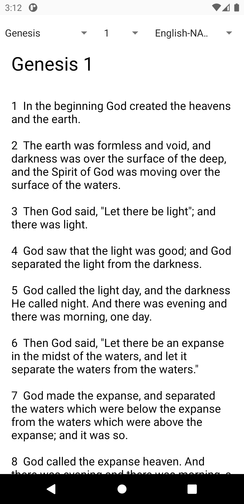
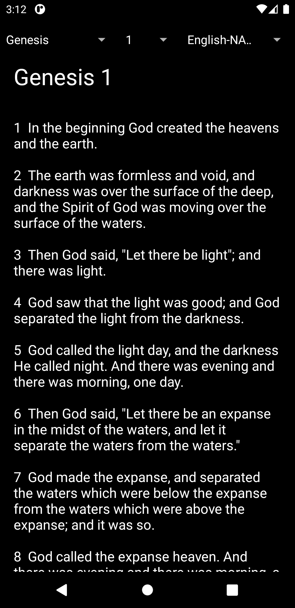

# SimpleBible
Simple Bible is an Android application specifically made for India. App still in progress. More Indian languages are to be added

# Releases
   Download from [here](https://github.com/goldnjohn/SimpleBible/releases/download/v0.1-alpha/SimpleBible.apk)
   
# Features
  * Selection of Chapter and Book are done by using Dropdown List
  * Currently there are two versions added `English-NASB` and `Telugu-BSI`
      
  * Text is selectable, so you an copy verses.
  * Number of chapters for each Book was not set. so you will see 150 chapters for every book. I'll try to fix that in next release
  
# Appearance
    Here are Screenshots 

# Notice
under development
